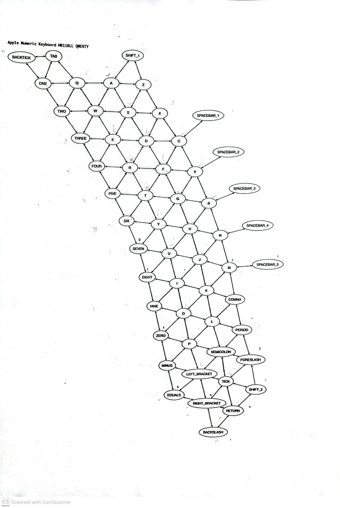

# KeyBoardLayout_Project

### Description:
 In my Algorithms and Data Structures class we developed our internal representation of how we could create a program to be able to tell the distance your finger traveled when typing words using the hunt and peck technique. Our main goal in doing so was to get the keyboard into the program in some data structure which we did in a couple of different ways, by first using a graph of all the keys we were using, where the edges were connected to the neighboring keys. We then created a hashmap to store all of the keys and their respective adjacent neighboring keys which will be useful in calculating the distances by creating the adjacency matrix. Most of the methods implemented use the adjacency matrix and the keyboard map to complie a distance matrix where the values are looked up and summed for each key that is typed (The distance between each neighboring key is assumed to be the length of 1 key). The distance returned will be the total number of key length distances the finger traveled. The program also allows for different keyboard layouts to be tested like Dvorack and Colemack utilizing a permutation.

### Visualization:
The image below is the main graph representing the keyboard layout we implemented



### Example Implementation:
```
protected KeyboardMetrics getKeyboardMetrics(KeyLayout keyLayout)
	{
		return new AppleNumericMB110LLKeyboardMetricsImpl_Martinez(keyLayout);
	}

public void simpleDistancesQwerty2()
	{
		TEST_GOAL_MESSAGE = "Calculate \"simple Qwerty\" distances correctly for strings";
  keyboardMetrics_STUDENT = getKeyboardMetrics(KeyLayout.QWERTY);
		assertEquals(71.0, keyboardMetrics_STUDENT.getDistance("abcdefghijklmnopqrstuvwxyz!"), 0.0);
		assertEquals(71.0, keyboardMetrics_STUDENT.getDistance("AbCdEfGhIjKlMnOpQrStUvWxYz!"), 0.0);
		assertEquals(66.0, keyboardMetrics_STUDENT.getDistance("mnopqrstuvwxyz!abcdefghijkl"), 0.0);
	}
```

Here is an example of a junit4 test where keylayout is an enumerated class of the different keyboard layouts you can enter into the program. Here the expected distances are tested compared to what is returned. When getDistance is called it will return the total distance for the typed words. For more in depth test cases check out the test folder. *It is important to note that some of the keylayouts have not been fully tested.

Credits: Instructor - Dr.Kart
